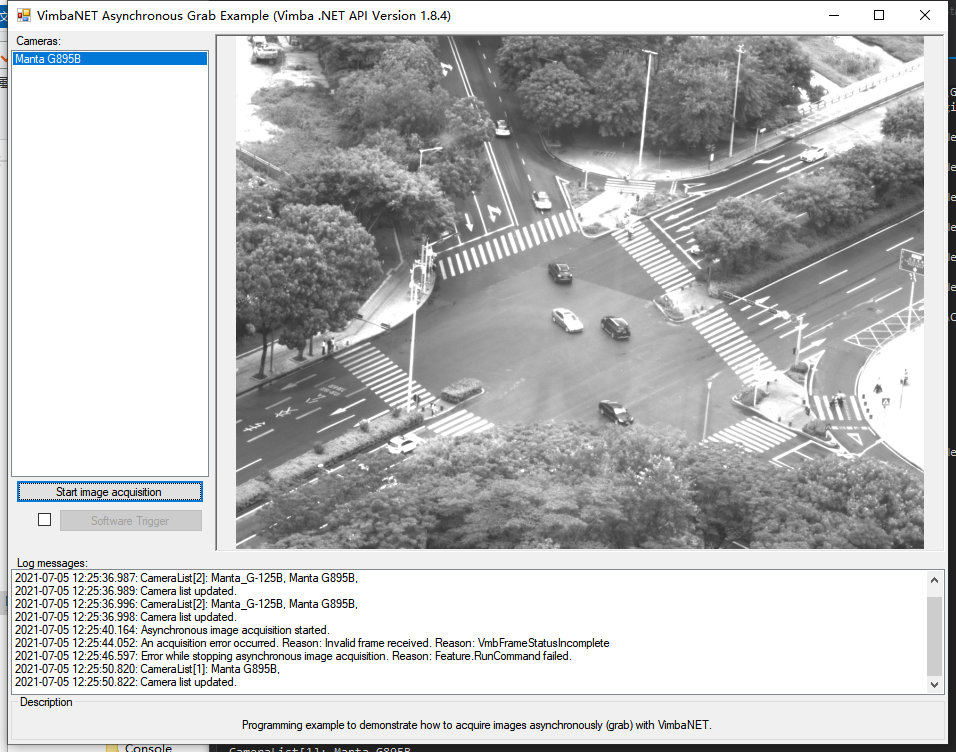

# vmb_net_AsynchronousGrab_Forms_Reconnect
Reconnecting sample based on Vimba C# AsynchronousGrab Forms example.

## 目录结构
1. `Forms` : Original Vimba C# AsynchronousGrab Forms example
2. `Forms.Reconnect` ：Reconnecting example when the camera lost and pugging again.

## 测试方法
  

  

## 使用限制

  

  

  